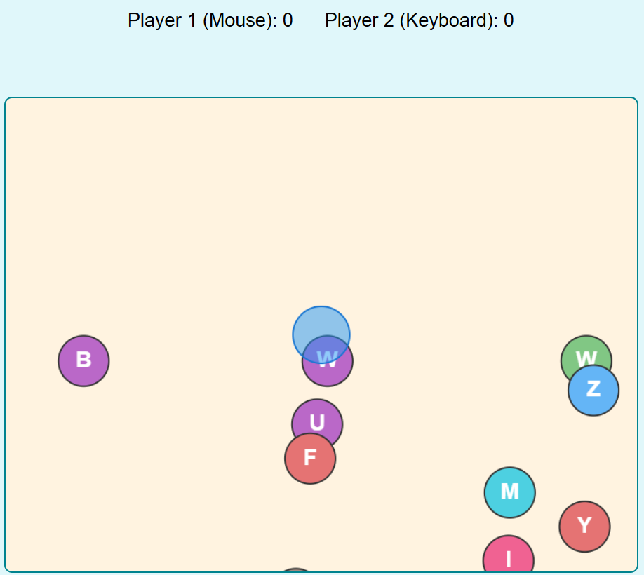

# Click - Pop Duel

A simple two-player browser game where players compete to pop balloons and score points. One player uses the mouse, the other uses the keyboard.

## How to Play
- **Player 1 (Mouse):** Click balloons to pop them.
- **Player 2 (Keyboard):** Move the blue pointer with WASD/Arrow keys and pop balloons with Spacebar.
- First to 30 points wins!

---

# Дуэль - Лопанье Шаров

Простая браузерная игра для двух игроков. Соревнуйтесь, кто быстрее наберёт 30 очков, лопая шары!

## Как играть
- **Игрок 1 (Мышь):** Лопайте шары кликом мыши.
- **Игрок 2 (Клавиатура):** Управляйте синим указателем с помощью WASD/стрелок и лопайте шары пробелом.
- Побеждает тот, кто первым наберёт 30 очков! 
